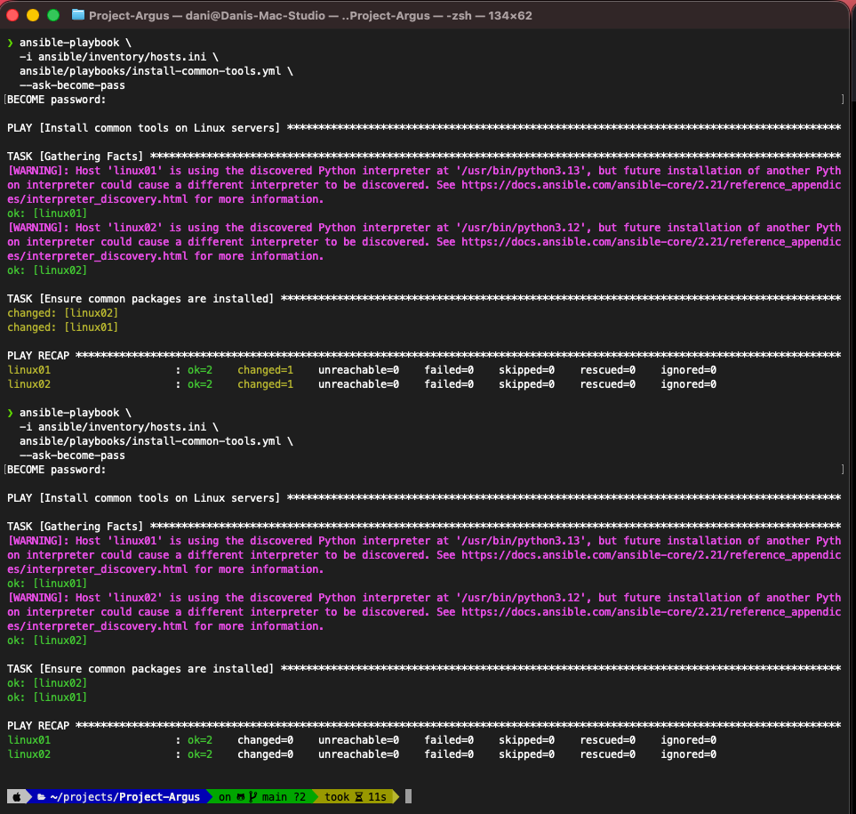
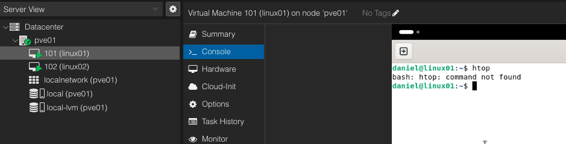
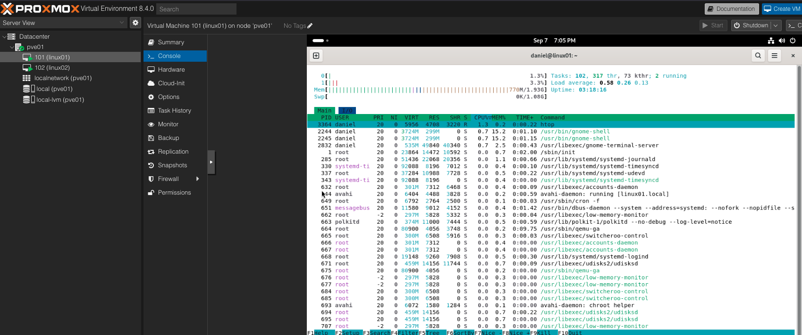

# Ansible Configuration Management

## Control Node

Mac Studio

## Managed Nodes

- linux01 — Debian 13
- linux02 — Ubuntu Server

SSH key authentication is configured for both systems.

Hosts can be accessed using:

```bash
ssh linux01
ssh linux02
```

---

Inventory
[linux_servers]
linux01
linux02

---

## Connectivity Test

ansible all \
  -i ansible/inventory/hosts.ini \
  -m ping

Both systems returned:

```bash
pong
```

## First Playbook

The first playbook ensures common administration tools are installed:

````bash
curl
git
htop
tree
First Execution
```

Both systems reported:

```bash
changed=1
```

Second Execution

Both systems reported:

```bash
changed=0
```

This demonstrates Ansible idempotency: once the desired state was reached, subsequent executions required no changes.

Screenshots:




